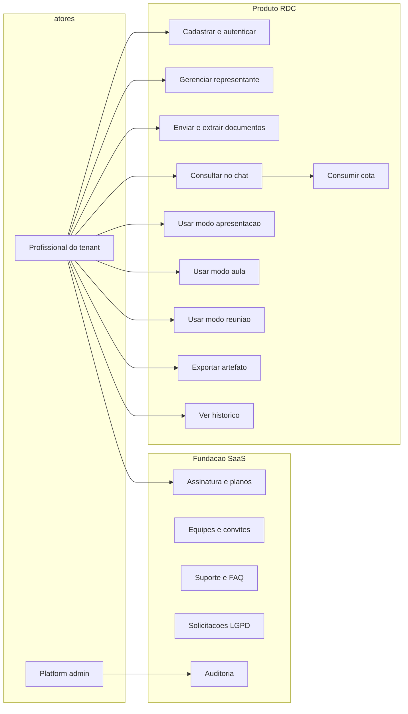
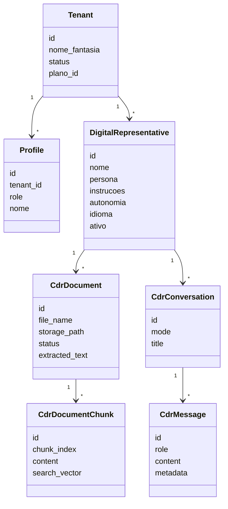
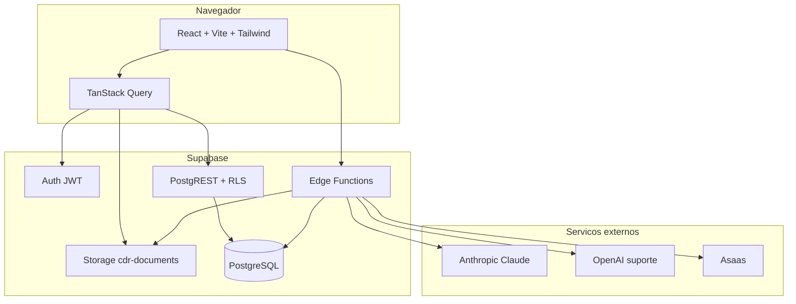
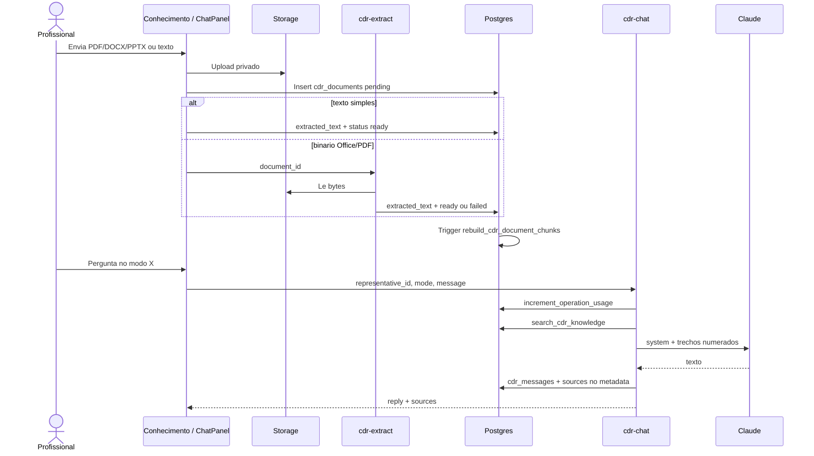

CARLOS ALBERTO DOS SANTOS

PLATAFORMA DE AMPLIFICAÇÃO DA COMUNICAÇÃO HUMANA BASEADA EM INTELIGÊNCIA ARTIFICIAL PARA APOIO A APRESENTAÇÕES, AULAS E REUNIÕES: Desenvolvimento de um Protótipo de Representante Digital Cognitivo

União da Vitória/PR

Setembro/2026

---

## Resumo

Este trabalho apresenta o desenvolvimento de um protótipo funcional da Plataforma de Amplificação da Comunicação Humana (HCAP), centrada no Representante Digital Cognitivo (RDC), capaz de apoiar o usuário em apresentações, aulas e reuniões digitais a partir de documentos autorizados pelo próprio titular. A temática situa-se na Engenharia de Software aplicada a sistemas multi-tenant com Inteligência Artificial generativa, e o problema enfrentado é a fragmentação das ferramentas atuais, que geram texto, transcrevem ou clonam voz sem preservar, de forma controlada, o conhecimento e os limites éticos de uma pessoa. O objetivo geral consistiu em construir o MVP web do RDC com cadastro, base de conhecimento, chat fundamentado em modelo de linguagem e modos de uso específicos. A metodologia adotada foi o Scrum, com entregas incrementais sobre uma fundação SaaS já existente (autenticação, isolamento por Row Level Security, assinatura, suporte, LGPD e auditoria). O produto foi implementado em React, TypeScript, Vite, Tailwind CSS, PostgreSQL/Supabase e Edge Functions; a geração de respostas utiliza a API Claude (Anthropic), com recuperação de trechos por busca full-text em português, citação de fontes e exportação de artefatos. Os testes unitários (Vitest) e a demonstração no ambiente local validaram o fluxo completo. Conclui-se que o escopo do MVP proposto no pré-projeto foi atendido, com a ressalva de que o backend previsto em FastAPI foi realizado de forma equivalente nas Edge Functions do Supabase, e que clonagem de voz, avatares 3D e videoconferência permaneceram, como combinado, fora do TCC.

Palavras-chave: inteligência artificial; representante digital cognitivo; engenharia de software.

---

## 1. INTRODUÇÃO

A transformação digital das últimas décadas, intensificada pelos avanços da Inteligência Artificial (IA), modificou a forma como pessoas estudam, trabalham, ensinam e compartilham conhecimento (SCHWAB, 2016; RUSSELL; NORVIG, 2021). A evolução dos modelos de linguagem de grande porte (*Large Language Models* – LLMs), possibilitada pela arquitetura *Transformer* proposta por Vaswani et al. (2017), ampliou as capacidades de compreensão e geração de linguagem natural e impulsionou sistemas aplicados à educação, à comunicação e à produção de conteúdo (BOMMASANI et al., 2021). Ao mesmo tempo, a adoção de ambientes digitais para reuniões, aulas, apresentações e treinamentos tornou evidente a necessidade de ferramentas que apoiem a transmissão de conhecimento de modo mais eficiente, personalizado e acessível.

Apesar dessa evolução, as soluções disponíveis concentram-se em funcionalidades isoladas — geração de texto, clonagem de voz, avatares ou transcrição — sem oferecer uma representação integrada do conhecimento e da forma de comunicação de um indivíduo (BOMMASANI et al., 2021; WANG et al., 2025). Professores, palestrantes, pesquisadores, profissionais corporativos e pessoas com limitações físicas ou de comunicação encontram dificuldades para participar de apresentações, ministrar aulas ou acompanhar reuniões digitais (WORLD HEALTH ORGANIZATION, 2022). Diante desse cenário, a questão de pesquisa permanece a formulada no pré-projeto: como desenvolver uma plataforma baseada em Inteligência Artificial capaz de ampliar a comunicação humana por meio de um Representante Digital Cognitivo, preservando o conhecimento do usuário e promovendo acessibilidade em ambientes digitais?

O objetivo geral deste trabalho consistiu em desenvolver um protótipo funcional da Plataforma de Amplificação da Comunicação Humana baseada em Inteligência Artificial, capaz de criar um Representante Digital Cognitivo para apoiar usuários em apresentações, aulas e reuniões digitais, utilizando documentos e bases de conhecimento fornecidas pelo próprio usuário para responder perguntas e transmitir informações de forma personalizada, ética e controlada.

Para alcançar esse objetivo, foram realizadas as seguintes atividades: levantamento bibliográfico sobre Inteligência Artificial, agentes inteligentes e tecnologias de comunicação digital; levantamento e especificação dos requisitos do sistema; modelagem da arquitetura da solução; desenvolvimento do protótipo com tecnologias modernas de desenvolvimento web e Inteligência Artificial; implementação dos módulos de gerenciamento de conhecimento, configuração do representante digital, modos de apresentação, aula e reunião; e validação do protótipo por meio de testes automatizados, demonstração das funcionalidades e publicação das Edge Functions no projeto Supabase.

A relevância do trabalho relaciona-se ao papel crescente da Inteligência Artificial como apoio às atividades humanas, especialmente na educação, na comunicação e na inclusão digital (UNESCO, 2023; RUSSELL; NORVIG, 2021). A proposta beneficia profissionais que realizam apresentações, treinamentos e atividades educacionais, e abre caminho para pessoas com dificuldades de comunicação ou limitações que impactam a participação em ambientes digitais (WORLD HEALTH ORGANIZATION, 2022). Do ponto de vista científico, contribui para o estudo de arquiteturas de software com IA aplicadas à comunicação humana; do ponto de vista tecnológico, entrega um MVP multi-tenant, auditável e alinhado à LGPD, que pode servir de base para pesquisas e produtos futuros — sem pretender, neste TCC, clonagem de voz, avatar tridimensional ou participação autônoma em videoconferência.

---

## 2. ESPECIFICAÇÕES INICIAIS DO SOFTWARE

Este capítulo consolida o que o pré-projeto definiu como escopo e o que o produto efetivamente especifica após a construção. Não se trata de repetir o PRE_TCC: aqui o escopo é o do **sistema entregue**.

### 2.1 Escopo do Produto

O produto é uma aplicação web denominada **Plataforma de Amplificação da Comunicação Humana (HCAP)**, cujo núcleo de valor é o **Representante Digital Cognitivo (RDC)**. O titular (ou a equipe do *tenant*) cria um ou mais representantes, descreve persona e limites éticos, envia documentos autorizados e passa a consultar esse conhecimento em quatro modos: chat livre, apresentação, aula e reunião.

O sistema reaproveita uma fundação SaaS já existente no repositório (*saas-foundation*), que fornece autenticação, multi-tenant com Row Level Security (RLS), planos e cota de operações, convites, suporte, LGPD e auditoria. O domínio do TCC acrescenta as tabelas e as funções do RDC, sem substituir essa base.

**Incluído no MVP deste TCC**

- Cadastro, login, recuperação de senha e perfis (`tenant_admin`, `collaborator`, `client`, `platform_admin`).
- Criação e edição de representantes digitais (nome, descrição, persona, instruções éticas, autonomia, idioma, ativo/inativo).
- Upload privado de documentos no Storage (`cdr-documents`), extração de texto e indexação em trechos.
- Chat com a API Claude, consumo de cota (`increment_operation_usage`) e persistência da conversa.
- Modos apresentação, aula e reunião, com instruções de formato distintas, atalhos na interface e exportação em Markdown.
- Citação das fontes (arquivo + trecho) usadas em cada resposta.
- Histórico de interações e eventos de auditoria na categoria `cdr`.
- Painel administrativo da plataforma (assinantes, planos, chamados, auditoria, LGPD), herdado da fundação.

**Explicitamente fora do escopo (igual ao PRE_TCC)**

- Clonagem de voz.
- Avatares 3D.
- Integração automática com plataformas de videoconferência.
- Participação autônoma do representante em reuniões ao vivo.
- Extração nativa de arquivos Office antigos (`.doc` / `.ppt`); o sistema pede conversão para DOCX, PPTX ou PDF.

**Limite intencional de conhecimento**

O RDC **não** treina um modelo próprio (não há *fine-tuning*). O “treinamento” do MVP é a formação de uma base autorizada: extração, fragmentação, busca e injeção dos trechos relevantes no *prompt* do modelo. Isso atende ao requisito ético de não inventar fatos e de recusar o que não estiver no material.

### 2.2 Funcionalidade do Produto

As funcionalidades abaixo descrevem **o que o usuário faz na interface**, não uma lista formal de requisitos IEEE. Cada item aponta a rota ou o módulo correspondente no protótipo.

#### 2.2.1 Conta, sessão e *tenant*

- Tela inicial institucional (`/`) com posicionamento HCAP/RDC e planos.
- Cadastro (`/cadastro`) com criação automática de *tenant*, perfil `tenant_admin` e cota do mês.
- Login, recuperação e redefinição de senha.
- Aceite de convite (`/aceitar-convite`).
- Perfil do profissional (`/perfil`) e configurações do *tenant* (`/configuracoes`).
- Portal do cliente final (`/cliente/*`), isolado do painel da equipe.

#### 2.2.2 Painel do assinante

- **Início** (`/dashboard`): saudação, barra de cota mensal de operações, cartões com quantidade de representantes, documentos e conversas.
- **Representantes** (`/representantes`): lista e formulário de criação (nome, descrição, persona, instruções).
- **Visão geral do RDC** (`/representantes/:id`): edição de persona, autonomia (supervisionado, assistido, autônomo), ativação e atalhos para os modos.
- **Conhecimento** (`/representantes/:id/conhecimento`): seleção de arquivos, envio, extração, status (`pending` / `ready` / `failed`) e exclusão.
- **Chat** (`/representantes/:id/chat`).
- **Apresentação** (`/representantes/:id/apresentacao`).
- **Aula** (`/representantes/:id/aula`).
- **Reunião** (`/representantes/:id/reuniao`).
- **Histórico** (`/historico`): lista de conversas, reabertura e exportação do artefato.
- Equipes, clientes, assinatura, suporte, chamados e LGPD (fundação).

#### 2.2.3 Chat e modos

O componente `ChatPanel` é compartilhado, mas **não** se comporta como um único chat com rótulo diferente:

| Modo | Comportamento na tela | Formato pedido ao modelo |
| --- | --- | --- |
| Chat | Campo de uma linha; atalhos genéricos | Resposta fiel à base |
| Apresentação | Área de texto, atalhos de roteiro/tópico/plateia, balões índigo, copiar | Tópico, “Falar”, transição |
| Aula | Atalhos didáticos, balões âmbar | Objetivo, passos, exemplo, pergunta à turma |
| Reunião | Atalhos de síntese/pendências, balões verde | Síntese, riscos, o que não está documentado |

Em todos os modos: confirmação explícita quando a autonomia é `supervised`; bloco **Fontes (N)** expansível; botão **Exportar** após a primeira resposta do assistente.

#### 2.2.4 Painel da plataforma

Usuário `platform_admin` acessa `/admin/dashboard`, assinantes, planos, chamados, auditoria e central LGPD. A promoção do primeiro administrador ocorre pela função SQL `bootstrap_platform_admin`, após o cadastro pelo próprio aplicativo.

#### 2.2.5 Relatórios e artefatos

Não há um módulo clássico de “relatórios gerenciais” do RDC além dos cartões do *dashboard*. O artefato de sessão é o Markdown exportado:

- apresentação → `roteiro-….md`
- aula → `plano-de-aula-….md`
- reunião → `minuta-….md`
- chat → `conversa-….md`

O arquivo contém representante, modo, data, falas e seção **Fontes autorizadas**.

### 2.3 Ambiente Operacional e Tecnologias

O sistema é uma aplicação web cliente-servidor, responsiva (Tailwind, *layout* com barra lateral e navegação inferior no mobile).

| Camada | Tecnologia efetivamente utilizada | Observação em relação ao PRE_TCC |
| --- | --- | --- |
| Frontend | React 18, TypeScript, Vite 5, Tailwind CSS 3, React Router 7, TanStack Query 5 | Conforme o pré-projeto |
| Backend de aplicação | Edge Functions (Deno) no Supabase | O PRE_TCC citava Python/FastAPI; o MVP usa Functions equivalentes (HTTP, JWT, *service role*) |
| Banco | PostgreSQL gerenciado pelo Supabase (projeto `kxzmxakwpmibgzapsufw`) | Conforme o pré-projeto |
| Auth e Storage | Supabase Auth e bucket privado `cdr-documents` | Conforme o pré-projeto |
| IA do RDC | API Anthropic Claude (`cdr-chat`) | Conforme o pré-projeto |
| IA de suporte | OpenAI na função `ai-support-chat` (fundação) | Não faz parte do núcleo do RDC |
| Pagamentos | Asaas (checkout, créditos, webhook) | Fundação SaaS |
| Testes | Vitest + Testing Library; pgTAP para RLS da fundação | |
| Qualidade | ESLint, TypeScript *strict*, gitleaks no CI | |
| Versionamento | Git / GitHub | https://github.com/carl-santos/rdc |
| IDE | Cursor (evolução do ambiente previsto VS Code / Claude Code) | |
| Hospedagem prevista | Vercel (frontend) e Supabase (API, banco, functions) | Desenvolvimento local na porta 3000 |
| Navegadores | Chromium, Firefox e Safari modernos | *SPA* sem *plugin* |

**Decisão FastAPI versus Edge Functions.** O pré-projeto previa um backend Python. No MVP, as regras de negócio do RDC (`cdr-chat`, `cdr-extract`) e da fundação (convites, Asaas, LGPD) residem em Edge Functions TypeScript/Deno, colocalizadas com Auth, Storage e Postgres. Isso reduz superfície de *deploy*, mantém um único provedor no TCC e preserva o contrato “API autenticada + banco com RLS”. FastAPI permanece evolução natural caso se deseje microserviços ML ou filas próprias, como o próprio README do produto registra.

**Secrets (não versionados).** `VITE_SUPABASE_URL` e `VITE_SUPABASE_ANON_KEY` no `.env.local`. Nas Functions: `ANTHROPIC_API_KEY`, opcionalmente `ANTHROPIC_WORKSPACE_ID` e `ANTHROPIC_MODEL`; demais chaves da fundação (Asaas, OpenAI) quando esses fluxos são exercitados.

---

## 3. METODOLOGIA DE DESENVOLVIMENTO DE SOFTWARE

O desenvolvimento seguiu a metodologia ágil **Scrum**, entendida como ciclo incremental de *backlog*, *sprint*, incremento demonstrável e retrospectiva informal (SCHWABER; SUTHERLAND, 2020; PRESSMAN; MAXIM, 2021). Não houve time Scrum completo (não há *Product Owner* e *Scrum Master* distintos do autor): o autor acumulou os papéis, o que é típico de TCC individual, mas manteve a disciplina de **entregas pequenas e testáveis** em vez de um ciclo em cascata único.

### 3.1 Visão do processo

1. **Levantamento bibliográfico e do problema** — consolidado no PRE_TCC (julho/2026).
2. **Especificação de requisitos** — lista de funcionalidades do MVP e exclusões (voz, 3D, videoconferência).
3. **Arquitetura** — reuso da fundação SaaS + domínio RDC no Postgres + Functions.
4. **Sprints de implementação** — cada incremento resultava em tela ou contrato de API utilizável.
5. **Verificação** — testes Vitest, conferência de *policies*, demonstração no `localhost:3000`, publicação das Functions.
6. **Documentação de resultados** — o presente artigo (TCC II).

### 3.2 Organização das sprints (reconstrução do incremento real)

O *backlog* do produto RDC foi fatiado de modo que cada sprint reduzisse um risco: isolamento de dados, extração, alucinação do modelo, indiferença dos modos, rastreabilidade e operação.

| Sprint (lógica) | Objetivo | Incremento visível |
| --- | --- | --- |
| 0 | Rebranding e schema do domínio | Identidade HCAP/RDC; tabelas `digital_representatives`, `cdr_documents`, `cdr_conversations`, `cdr_messages`; bucket `cdr-documents` |
| 1 | CRUD do representante e upload | Telas de lista, visão geral e conhecimento |
| 2 | Extração e chat | `cdr-extract` (PDF/DOCX/PPTX); `cdr-chat` com Claude; cota por consulta |
| 3 | Recuperação de conhecimento | `cdr_document_chunks`, trigger, RPC `search_cdr_knowledge`; prompt deixa de cortar 24 mil caracteres cegamente |
| 4 | Diferenciação de modos e proveniência | Atalhos, formatos de saída, fontes na UI, exportação Markdown |
| 5 | Operação da fundação | Publicação das Edge Functions de convite, Asaas, LGPD, suporte e CSP |

Essa cadência corresponde ao princípio Scrum de **potentially shippable increment**: ao fim de cada bloco o usuário já podia criar um RDC, ou já podia conversar, ou já via fontes, sem esperar o “sistema completo”.

### 3.3 Requisitos não funcionais tratados na construção

- **Isolamento:** RLS em todas as tabelas do domínio; *helpers* `SECURITY DEFINER` com `search_path` fixo.
- **Autorização:** JWT no *gateway* das Functions **e** `getUser()` + papel + posse do representante/documento.
- **Cota e *gating* de assinatura:** `increment_operation_usage`; *trigger* `check_tenant_active` em inserts do RDC.
- **Privacidade:** bucket privado; texto extraído não é público; LGPD herdada (acesso, portabilidade, revogação, exclusão).
- **Observabilidade:** `audit_logs` com categoria `cdr`; `log-audit` para eventos de sessão.
- **Qualidade:** TypeScript, lint, testes de unidades de extração, montagem de *prompt*, presets de modo e exportação.

### 3.4 Verificação e validação

A verificação combinou:

- testes automatizados de *front* (60 casos na última execução completa do Vitest, incluindo `cdrDocuments`, `cdrKnowledge`, `cdrExport`, `modePresets` e *route guards*);
- testes pgTAP de isolamento da fundação (`supabase/tests/rls_tenant_isolation_test.sql`) — ainda **não** estendidos às tabelas `cdr_*`, o que se registra como limitação;
- testes manuais no navegador (cadastro do autor, *upload*, chat com Claude, modos, exportação);
- inspeção das Functions publicadas (`verify_jwt` verdadeiro, exceto `asaas-webhook` e `csp-report`).

Não foi realizado experimento controlado com amostra de professores ou palestrantes (avaliação de usabilidade SUS, por exemplo). A validação do TCC II é **funcional e demonstrativa**, alinhada ao objetivo de “protótipo funcional”, não a um ensaio clínico de inclusão.

---

## 4. DESENVOLVIMENTO

Esta seção descreve a construção do software, alinhada aos objetivos específicos da Introdução. Os subtópicos 4.1 a 4.6 correspondem a essas atividades.

### 4.1 Levantamento bibliográfico e posicionamento

O referencial do PRE_TCC (Schwab, Russell e Norvig, Bommasani, Vaswani, UNESCO, OMS, Scrum Guide) permanece válido. No desenvolvimento, duas decisões de *software* dialogam com essa literatura:

- **Agente com conhecimento ancorado**, e não LLM “aberto”: o *prompt* do RDC ordena recusar o que não está nos trechos recuperados (mitigação de alucinação, alinhada à preocupação ética de Bommasani et al., 2021, e à orientação da UNESCO, 2023).
- **Representação cognitiva, não midiática:** Wang et al. (2025) discutem gêmeos digitais conversacionais; o MVP implementa o eixo *conhecimento + persona + autonomia*, deixando voz e corpo 3D para trabalho futuro.

### 4.2 Requisitos e casos de uso

#### 4.2.1 Atores

- **Titular / profissional do *tenant*** (`tenant_admin` ou `collaborator`): cria o RDC, envia documentos, consulta nos modos, exporta artefatos.
- **Cliente final** (`client`): usa o portal herdado da fundação; **não** opera o RDC neste MVP.
- **Administrador da plataforma** (`platform_admin`): opera *tenants*, planos, suporte, auditoria e LGPD.
- **Sistemas externos:** Asaas (webhook de pagamento); navegador (relatórios CSP).

#### 4.2.2 Diagrama de casos de uso (visão do MVP)

Casos de uso centrais do RDC, em formato textual (UML):

| ID | Caso de uso | Ator | Pré-condição | Fluxo básico | Pós-condição |
| --- | --- | --- | --- | --- | --- |
| UC-01 | Criar representante | Profissional | *Tenant* ativo | Informa nome, persona, instruções, autonomia | Linha em `digital_representatives` |
| UC-02 | Enviar documento | Profissional | RDC existente | *Upload* no Storage + metadados | `cdr_documents` com `status` |
| UC-03 | Extrair texto | Profissional | Arquivo no Storage | `.txt/.md/.csv` no browser; PDF/DOCX/PPTX em `cdr-extract` | `extracted_text`; *trigger* gera *chunks* se `ready` |
| UC-04 | Consultar RDC | Profissional | RDC ativo, cota disponível | `cdr-chat` busca trechos, chama Claude, grava mensagens | Conversa + auditoria `cdr_chat` |
| UC-05 | Exportar sessão | Profissional | Há resposta do assistente | Gera Markdown no cliente | *Download* `.md` |

#### 4.2.3 Diagrama de classes (domínio persistido)

O modelo persistente é relacional. Em visão de classes de análise:

Autonomia: `supervised` | `assisted` | `autonomous`.  
Modo da conversa: `chat` | `presentation` | `class` | `meeting`.  
Status do documento: `pending` | `ready` | `failed`.

### 4.3 Arquitetura e implantação

#### 4.3.1 Visão em camadas

O **isolamento não está no React**: está no Postgres. O *frontend* envia o JWT; as *policies* filtram por `get_my_tenant_id()`. As Functions `cdr-chat` e `cdr-extract` repetem a checagem de papel (`tenant_admin`, `collaborator`, `platform_admin`) e de posse.

#### 4.3.2 Fluxo de conhecimento (do arquivo à resposta)

#### 4.3.3 Recuperação (*RAG* lexical)

Não foram usados *embeddings*. A escolha, adequada ao volume do MVP e ao idioma, foi **PostgreSQL full-text em português**:

- Fragmentos de cerca de 1.200 caracteres (`rebuild_cdr_document_chunks`).
- Índice GIN em `search_vector`.
- RPC `search_cdr_knowledge(p_representative_id, p_query, p_limit)` com `websearch_to_tsquery` / `plainto_tsquery`, *ranking* `ts_rank_cd`, *fallback* para os primeiros trechos se a consulta não casar.
- Montagem do *prompt* limitada a cerca de 16 mil caracteres (`assembleRetrievedKnowledge`).
- Fontes devolvidas e gravadas em `cdr_messages.metadata.sources`.

#### 4.3.4 Edge Functions publicadas

Todas as funções presentes em `supabase/functions/` foram publicadas no projeto remoto e conferidas como ACTIVE.

| Função | JWT no gateway | Papel no TCC |
| --- | --- | --- |
| `cdr-chat` | sim | Núcleo: consulta ao RDC |
| `cdr-extract` | sim | Extração PDF/DOCX/PPTX |
| `log-audit` | sim | Auditoria de sessão |
| `invite-client` / `invite-team-member` | sim | Fundação |
| `admin-impersonate` | sim | Fundação |
| `process-lgpd-request` | sim | Fundação |
| `ai-support-chat` | sim | Fundação |
| `asaas-checkout` / `credits` / `subscription-manage` | sim | Fundação |
| `asaas-webhook` | **não** | Token Asaas |
| `csp-report` | **não** | Relatório do navegador |

#### 4.3.5 Requisitos de implantação

- Conta Supabase com migrations aplicadas (baseline da fundação + `cdr_domain` + correções de Storage + `cdr_knowledge_chunks`).
- Secrets Anthropic para o chat funcionar de ponta a ponta.
- *Frontend:* Node/pnpm, `pnpm dev` na porta **3000** (`strictPort`).
- Produção prevista: Vercel apontando para o mesmo projeto; CSP reporta para `csp-report`.
- Repositório público obrigatório do template: **https://github.com/carl-santos/rdc**

### 4.4 Implementação dos módulos do objetivo específico

#### 4.4.1 Gerenciamento de conhecimento

Arquivos permitidos: `.txt`, `.md`, `.csv`, `.pdf`, `.docx`, `.pptx` (e `.doc`/`.ppt` apenas para recusar com mensagem de conversão). Limite 10 MB. MIME no cliente é forçado pela extensão, porque o Windows frequentemente envia `octet-stream`.

Após instabilidade inicial (HTTP 400 no Storage por lista rígida de MIME e *policy* que não incluía `platform_admin`), o bucket passou a aceitar *upload* profissional/admin sem *allowlist* de MIME no Storage, mantendo a validação no aplicativo.

Textos curtos extraem-se no navegador (`src/utils/cdrDocuments.ts`). Binários passam por `cdr-extract` (`unpdf`, `mammoth`, `JSZip`).

#### 4.4.2 “Treinamento” do representante

A tela de visão geral grava `persona`, `instrucoes` e `autonomia`. Esses campos entram no *system prompt* de `cdr-chat`. Não há época de treino estatístico: cada consulta reconstitui o contexto com persona + instruções + trechos recuperados + histórico recente (até 20 mensagens).

Níveis:

- **Supervisionado:** a UI pede confirmação antes de tratar a fala como autorizada; o modelo é instruído a deixar a dependência explícita.
- **Assistido:** responde e sinaliza incerteza.
- **Autônomo:** responde diretamente, ainda recusando o não documentado.

#### 4.4.3 Apresentações, aulas e reuniões

Além do campo `mode` persistido em `cdr_conversations`, o produto diferencia:

1. **Instruções de sistema** em `cdr-chat` (formato obrigatório por modo).
2. **Presets de interface** em `modePresets.ts` (atalhos, *placeholders*, estados vazios).
3. **Aparência** dos balões e ação de copiar (fala pronta).
4. **Artefato** exportável com título próprio (roteiro / plano / minuta).

Isso responde à crítica de que “três rotas apontando para o mesmo chat” não bastariam para o TCC: o modo altera contrato de saída, interação e entregável.

### 4.5 Telas e trechos de código relevantes

As telas principais do fluxo do MVP (para captura de *prints* na versão final do artigo):

1. Home institucional com a proposta HCAP.
2. Cadastro / login.
3. *Dashboard* com cota e totais.
4. Lista de representantes.
5. Visão geral (persona, autonomia, cartões dos modos).
6. Base de conhecimento (lista, status Pronto/Falha, extrair).
7. Chat com fontes expandíveis.
8. Apresentação / aula / reunião (atalhos visíveis).
9. Histórico com botão Exportar.
10. Painel admin (visão da plataforma).

Trecho representativo da recuperação no servidor (`cdr-chat`): a Function chama `search_cdr_knowledge`, monta o contexto numerado `[1]`, `[2]`, instrui o modelo a citar apenas esses índices e devolve `sources` no JSON e no `metadata` da mensagem.

Trecho representativo no cliente: `ChatPanel` invoca `cdr-chat`, anexa `sources` à mensagem local e renderiza `CdrSources`; `buildSessionMarkdown` gera o arquivo baixado.

### 4.6 Validação funcional observada

No ambiente do autor (Windows 10, Chrome, `localhost:3000`, projeto Supabase `kxzmxakwpmibgzapsufw`):

- Primeiro usuário promovido a `platform_admin` via `bootstrap_platform_admin`.
- Representante de exemplo (“Professor Carlos”) criado e utilizado.
- Documento `00-RELATORIO-GERAL.md` extraído e fatiado em 19 trechos.
- Chat com Claude operacional após correção de chave, *workspace* e ID de modelo.
- Extração de DOCX/PDF/PPTX disponível pela Function `cdr-extract`.
- Exportação Markdown e fontes na conversa implementadas.
- 13 Edge Functions ACTIVE.

Falhas encontradas e corrigidas durante o desenvolvimento (registro de engenharia, úteis à banca):

| Problema | Causa | Correção |
| --- | --- | --- |
| *Upload* 400 | MIME vazio/`octet-stream` rejeitado pelo bucket | *Allowlist* relaxada; MIME pela extensão |
| Chat 502 `invalid x-api-key` | Chave inválida ou com espaço | `trim` e secret `sk-ant-` |
| Chat 502 *workspace* | Chave não vinculada | Secret `ANTHROPIC_WORKSPACE_ID` |
| Modelo 404 | ID `claude-sonnet-4-20250514` indisponível | *Fallback* de modelos |
| *Prompt* truncado | Concatenação de 24k caracteres | *Chunks* + FTS |
| `platform_admin` sem *upload* | `is_tenant_professional()` não inclui admin | *Policy* de Storage com `is_platform_admin()` |

### 4.7 Repositório público

O código-fonte do protótipo está em:

**https://github.com/carl-santos/rdc**

O README do repositório descreve *stack*, domínio RDC, variáveis de ambiente e comandos (`pnpm dev`, `pnpm test:run`, *deploy* de Functions).

---

## 5. CONSIDERAÇÕES FINAIS

Este TCC II documenta a construção do protótipo da Plataforma de Amplificação da Comunicação Humana e do Representante Digital Cognitivo proposto no PRE_TCC. O processo uniu reuso de uma fundação SaaS multi-tenant à implementação do domínio de produto: representante, conhecimento extraído e indexado, consulta a um LLM com âncora documental, modos de uso distinguíveis e rastreio de fontes. Os resultados mostram que é viável, no recorte de um MVP acadêmico, oferecer apoio a apresentações, aulas e reuniões **sem** recorrer a voz sintetizada ou avatar, privilegiando controle ético, cota, auditoria e LGPD.

Os objetivos específicos foram cumpridos na dimensão de engenharia de software: houve especificação, arquitetura, implementação incremental (Scrum adaptado a autor único), testes automatizados pontuais e demonstração. A hipótese implícita — de que um representante alimentado só com material autorizado reduz a invenção de fatos em relação a um chat genérico — não foi medida com experimento formal, mas foi **operacionalizada** no software (recusa explícita, trechos recuperados, citações visíveis). Essa é uma contribuição concreta e demonstrável em banca.

Como limitações, registram-se: (i) substituição do FastAPI por Edge Functions, equivalente em papel mas diferente da *stack* literal do pré-projeto; (ii) recuperação lexical sem *embeddings*, suficiente para o volume atual e limitada semanticamente; (iii) testes pgTAP ainda não cobrindo tabelas `cdr_*`; (iv) *seed* do chatbot de suporte da fundação vazio neste projeto; (v) ausência de estudo de usabilidade com usuários-alvo. Nenhuma dessas limitações esvazia o MVP combinado.

Trabalhos futuros incluem *embeddings* e re-ranking, testes de isolamento RLS do domínio RDC, avaliação com professores e palestrantes, publicação estável do *frontend* na Vercel, e — fora deste TCC, como já delimitado — voz, representação 3D e ponte com videoconferência. O repositório público e este relatório permitem a continuidade da pesquisa e a reprodução do protótipo.

---

## 6. CONFERÊNCIA COM O PRE_TCC: O QUE FOI PROPOSTO E O QUE FOI IMPLEMENTADO

Esta seção responde de forma explícita à pergunta: **tudo o que o PRE_TCC propôs para o MVP foi implementado?**

A resposta resumida é: **sim, o escopo funcional do MVP do Representante Digital Cognitivo foi implementado.** Itens fora de escopo permaneceram fora. Houve **uma substituição tecnológica consciente** (FastAPI → Edge Functions) e **evoluções que o pré-projeto não detalhava** (RAG por trechos, fontes na UI, exportação de artefato), as quais reforçam o objetivo geral em vez de contradizê-lo.

### 6.1 Objetivos

| Item do PRE_TCC | Situação no protótipo |
| --- | --- |
| Objetivo geral: protótipo HCAP/RDC para apresentações, aulas e reuniões, com documentos do usuário, respostas personalizadas, éticas e controladas | **Atendido.** Chat + três modos + persona/instruções + recusa do não documentado + fontes. |
| Levantamento bibliográfico | **Atendido** no PRE_TCC e retomado neste artigo. |
| Especificação de requisitos | **Atendido** (capítulo 2 e casos de uso). |
| Modelagem da arquitetura | **Atendido** (capítulo 4.3). |
| Desenvolvimento web + IA | **Atendido** (React/TS + Claude). |
| Módulo de conhecimento | **Atendido** (upload, extração, *chunks*). |
| “Treinamento” do representante | **Atendido no sentido do MVP** (persona + base; sem *fine-tuning*, o que é coerente com ética e prazo). |
| Módulos apresentação e reunião (e aula, listada nas funcionalidades) | **Atendido** com modos distintos. |
| Validação por testes e demonstração | **Atendido parcialmente no rigor científico** (testes unitários + demo); sem ensaio de campo. |

### 6.2 Funcionalidades listadas no PRE_TCC (seção 2.2)

| Funcionalidade proposta | Implementada? | Onde |
| --- | --- | --- |
| Cadastro e autenticação | Sim | `/cadastro`, `/login`, Auth |
| Gerenciamento de perfis | Sim | `/perfil`, papéis, convites |
| Criação de RDCs | Sim | `/representantes` |
| *Upload* e gerenciamento de documentos | Sim | Conhecimento + Storage |
| Organização da base | Sim | Lista, status, extração, *chunks* |
| Chat inteligente baseado em IA | Sim | `cdr-chat` + Claude |
| Modo Apresentação | Sim | Rota + *prompt* + UI |
| Modo Aula | Sim | Idem |
| Modo Reunião | Sim | Idem |
| Níveis de autonomia | Sim | `supervised` / `assisted` / `autonomous` |
| Painel administrativo | Sim | `/admin/*` (fundação) |
| Histórico de interações | Sim | `/historico` |
| Registro e auditoria básica | Sim | `audit_logs` categoria `cdr` |

### 6.3 Escopo negativo (não deveria ser feito neste TCC)

| Item | Status |
| --- | --- |
| Clonagem de voz | **Não implementado** (correto) |
| Avatares 3D | **Não implementado** (correto) |
| Integração automática com videoconferência | **Não implementado** (correto) |
| Participação autônoma em reuniões | **Não implementado** (correto) |

### 6.4 Tecnologias previstas versus realizadas

| Previsto no PRE_TCC | Realizado | Avaliação |
| --- | --- | --- |
| React, TypeScript, Tailwind | Sim | Conforme |
| Python e FastAPI | **Não**; Edge Functions Deno/TS | Equivalente para o MVP; deve ser declarado na banca |
| PostgreSQL e Supabase | Sim | Conforme |
| Supabase Storage | Sim | Conforme |
| API Claude | Sim | Conforme |
| Git e GitHub | Sim | https://github.com/carl-santos/rdc |
| VS Code / Claude Code | Cursor | Ferramenta de desenvolvimento |
| Vercel + Supabase | Supabase em produção para API/banco/functions; *front* validado localmente na porta 3000 | Hospedagem do *front* em Vercel é passo de *release*, não de escopo funcional |

### 6.5 Entregas adicionais (além do mínimo do PRE_TCC)

Estes itens **não** estavam detalhados no pré-projeto e foram incorporados porque o MVP ficaria frágil sem eles:

- Recuperação por trechos (evita cortar a base em 24 mil caracteres).
- Fontes visíveis e persistidas.
- Exportação de roteiro / plano de aula / minuta.
- Extração servidor de PDF, DOCX e PPTX.
- Cota por consulta ao RDC e bloqueio quando o *tenant* não está ativo.

### 6.6 Itens da fundação SaaS (não eram o núcleo do PRE_TCC, mas o produto os carrega)

Implementados no código e, ao final do trabalho, **publicados** como Functions: convites, Asaas, LGPD, chat de suporte, impersonação, CSP. O *seed* de fluxos do chatbot de suporte (`chatbot_flows`) neste projeto remoto está vazio: é resíduo da fundação, **não** um requisito do RDC no PRE_TCC.

### 6.7 Síntese para a banca

**O PRE_TCC pediu um protótipo web de RDC, com conhecimento do usuário, chat com Claude, modos de apresentação/aula/reunião, autonomia, histórico e auditoria, sem voz/3D/vídeo. Isso foi entregue.**

A única divergência estrutural a explicitar é a **ausência do FastAPI**, substituído pelas Edge Functions. Do ponto de vista do objetivo geral e das funcionalidades do MVP, a proposta foi realizada.

---

## REFERÊNCIAS

ANTHROPIC. *Claude Documentation*. San Francisco: Anthropic, 2025. Disponível em: https://docs.anthropic.com/. Acesso em: 10 jun. 2026.

BOMMASANI, Rishi et al. *On the Opportunities and Risks of Foundation Models*. Stanford: Stanford University, Center for Research on Foundation Models (CRFM), 2021. Disponível em: https://arxiv.org/abs/2108.07258. Acesso em: 4 jun. 2026.

GOODFELLOW, Ian; BENGIO, Yoshua; COURVILLE, Aaron. *Deep Learning*. Cambridge: MIT Press, 2016.

OPENAI. *GPT Models Documentation*. San Francisco: OpenAI, 2025. Disponível em: https://platform.openai.com/docs. Acesso em: 1 jul. 2026.

PRESSMAN, Roger S.; MAXIM, Bruce R. *Engenharia de Software: uma abordagem profissional*. 9. ed. Porto Alegre: AMGH, 2021.

RUSSELL, Stuart; NORVIG, Peter. *Artificial Intelligence: A Modern Approach*. 4. ed. Hoboken: Pearson, 2021.

SCHWAB, Klaus. *A Quarta Revolução Industrial*. São Paulo: Edipro, 2016.

SCHWABER, Ken; SUTHERLAND, Jeff. *The Scrum Guide*. 2020. Disponível em: https://scrumguides.org/. Acesso em: 22 maio 2026.

SOMMERVILLE, Ian. *Engenharia de Software*. 10. ed. São Paulo: Pearson, 2019.

SUPABASE. *Supabase Documentation*. Disponível em: https://supabase.com/docs. Acesso em: 10 set. 2026.

UNESCO. *Guidance for Generative AI in Education and Research*. Paris: UNESCO, 2023. Disponível em: https://unesdoc.unesco.org/. Acesso em: 2 jul. 2026.

VASWANI, Ashish et al. Attention is all you need. In: *Advances in Neural Information Processing Systems (NeurIPS)*. Long Beach: NeurIPS, 2017. p. 5998-6008. Disponível em: https://arxiv.org/abs/1706.03762. Acesso em: 11 jun. 2026.

WANG, X. et al. *A Human Digital Twin Architecture for Knowledge-based Interactions and Context-Aware Conversations*. arXiv, 2025. Disponível em: https://arxiv.org/abs/2504.03147. Acesso em: 25 maio 2026.

WORLD HEALTH ORGANIZATION. *Global Report on Health Equity for Persons with Disabilities*. Geneva: World Health Organization, 2022. Disponível em: https://www.who.int/. Acesso em: 18 maio 2026.
